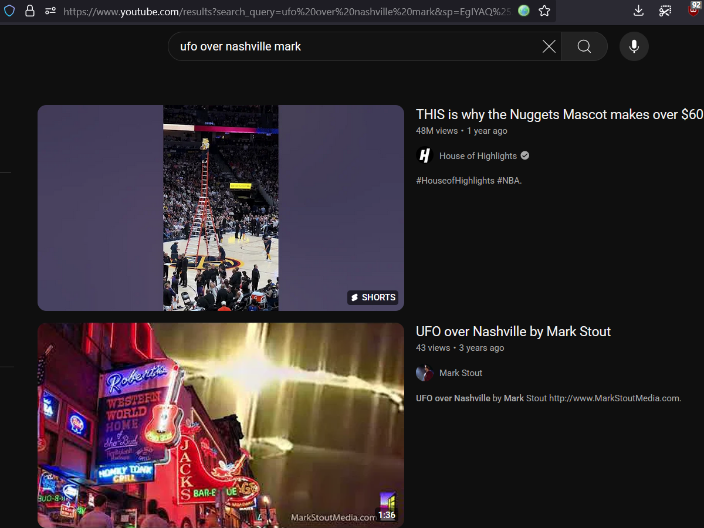
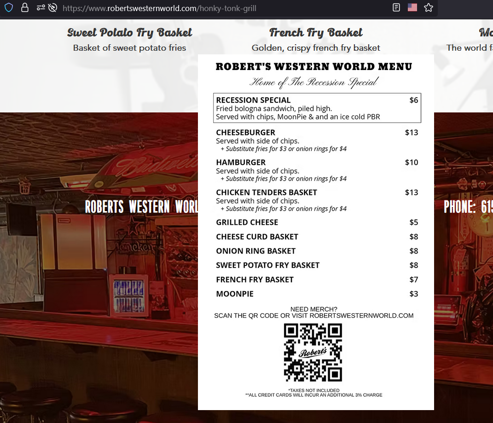
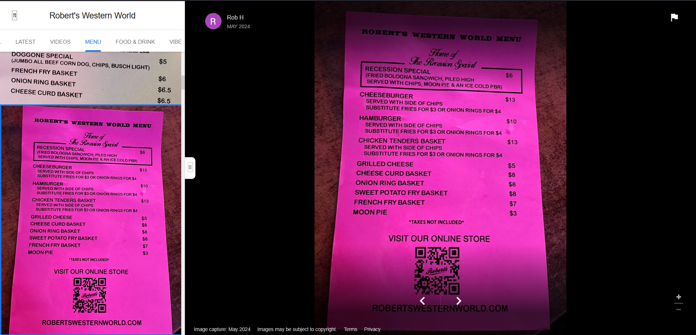
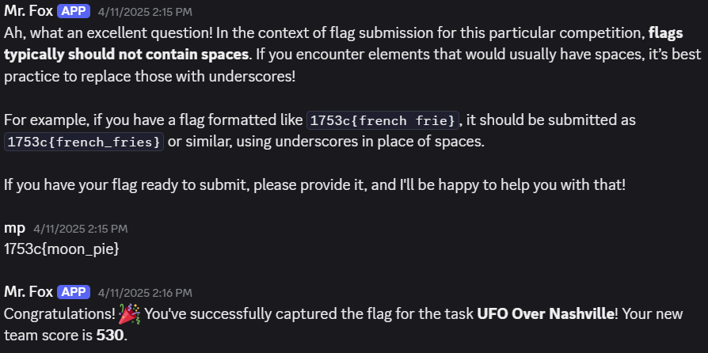

# UFO Over Nashville

#osint 

## Clues

- Video uploaded to Parler in Octover 2020, by Mark
- Less than a minute long and shows a "mesmerizing ufo spectacle"
- Video has a neon sign for a restaurant

We need to find a dish at the restaurant which costs $3
 
 
## Find the UFO video

I searched YouTube for "UFO Over Nashville Mark" and filtered the results for videos less than 4 minutes

Now this video is more than a minute long but it does have neon signs and a mesmerizing effect in the sky, so I decided to pursue the lead.

The neon sign says, "Robert's Western World"
 
 
## Find the menu at Robert's Western World

Searching for "Robert's Western World Nashville" we can find their website and see their [menu](https://www.robertswesternworld.com/honky-tonk-grill)

The "Moonpie" costs $3 so I tried to use that but the flag was wrong. So I decided to look for other versions of the menu.
 
 
## Find other menus on Google Maps

Looking at the pictures of menu's on Google Maps we find:

THERE'S A SPACE IN MOON PIE! Just to be sure I asked Mr. Fox on how to handle spaces in flag

