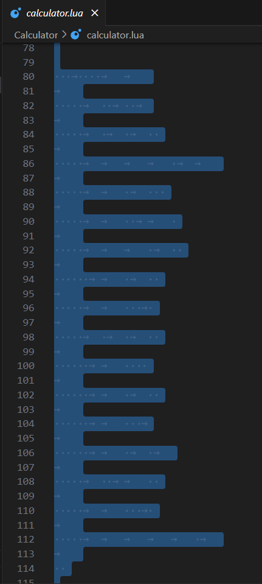

# Calculator

#misc

- [Calculator](#calculator)
  - [Decoding Tabs and Spaces](#decoding-tabs-and-spaces)
    - [Raw tabs and spaces](#raw-tabs-and-spaces)


There is a suspiciously large whitespace at the bottom of the file. Opening the file in VS Code we can see that the whitespace is made up of a combination of spaces and tabs, indicated by `.` for a space and `->` for a tab.

[calculator.lua](/Calculator/calculator.lua)
<br>




I copied over the spaces and tabs into a separate file, [tabs_and_spaces.txt](/Calculator/tabs_and_spaces.txt)

At first the format looked like morse code so I wrote a Python script to replace each space with a `.` and tab with a `-`, but the resulting morse code was invalid. 

Another approach I thought of was to convert them to binary instead, since we only have two unique characters. 


## Decoding Tabs and Spaces

[decode.py](/Calculator/decode.py)
<br>

```py
with open("tabs_and_spaces.txt", 'r') as f:
    content = f.readlines()

flag = ''

for word in content:
    binary = ''
    for char in word:
        if char == ' ':
            binary += '0'
        elif char == '\t':
            binary += '1'
        elif char == '\n':
            binary += ' '
            
    ascii_code = int(binary, 2)

    # Do not append Start of Header (SOH) character
    flag += chr(ascii_code) if ascii_code > 1 else '' 

print("Flag:", flag)
```

### Raw tabs and spaces

Each element represent a line
```py
['   \t    \t\t\n', '\t\n', '     \t  \t  \t\n', '\t\n', '     \t \t \t  \n', '\t\n', '     \t\t\t\t \t\t\n', '\t\n', '     \t\t \t   \n', '\t\n', '     \t\t  \t\t \n', '\t\n', '     \t\t\t \t  \n', '\t\n', '      \t\t \t  \n', '\t\n', '     \t\t   \t \n', '\t\n', '     \t \t \t  \n', '\t\n', '      \t\t    \n', '\t\n', '      \t\t \t  \n', '\t\n', '      \t\t   \t\n', '\t\n', '      \t\t \t \t\n', '\t\n', '     \t  \t\t  \n', '\t\n', '     \t\t   \t \n', '\t\n', '     \t\t\t\t\t \t\n', '\t\n', '  ']
```

Including the SOH character (ASCII code 1) will insert a default glyph in between each character like this:

```
C☺I☺T☺{☺h☺f☺t☺4☺b☺T☺0☺4☺1☺5☺L☺b☺}☺`
```

**Flag:** `Flag: CIT{hft4bT0415Lb}`