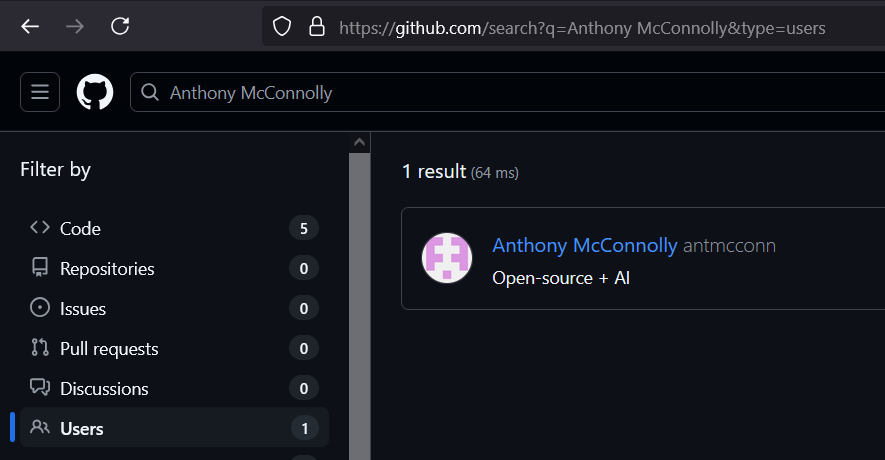
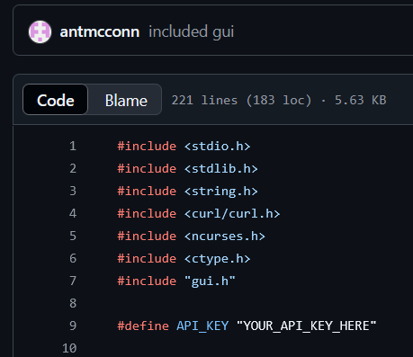
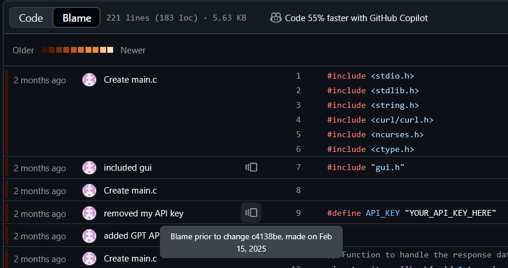
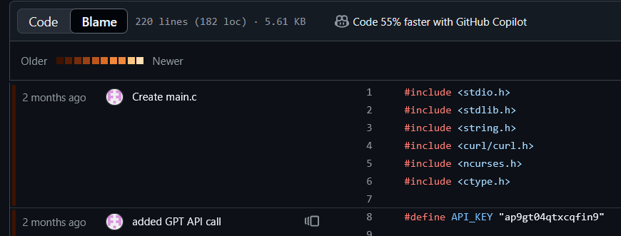

# No Country for Old Keys

#osint 

- [No Country for Old Keys](#no-country-for-old-keys)
  - [The Clues](#the-clues)
  - [The Search](#the-search)
  - [Back to the Past](#back-to-the-past)

## The Clues

We need to find the API Key of someone named Anthony McConnolly

## The Search

I use DuckDuckGo as my default search engine so I looked up "Anthony McConnolly" and found this GitHub

Alternatively you can also search for his name on GitHub and filter by users

For some reason I could not find his GitHub on the first page of Google.

He only has one repo with a single `main.c` file with a macro `API_KEY`, but it seems like he has changed it to a placeholder.

## Back to the Past

Let's view the revision history of `main.c`

Seems like the API Key was changed, lets look at the change

There's our key!