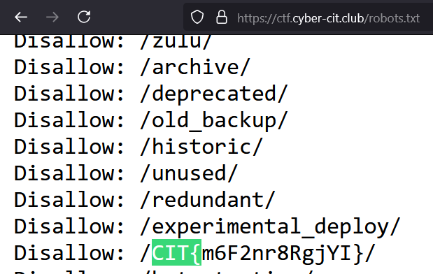

# Robots

#misc #web

The challenge name is a hint at the [robots.txt](https://en.wikipedia.org/wiki/Robots.txt) file which specifies which parts of a website a particular web crawler/scraper is allowed to access

We simply go to `/robots.txt` on the CTF website and search for `CIT{` to get the flag.

