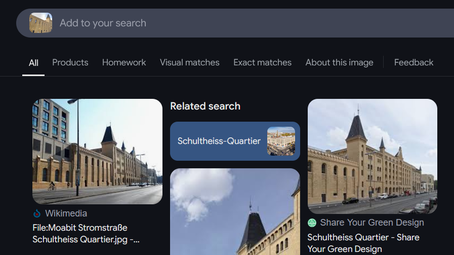
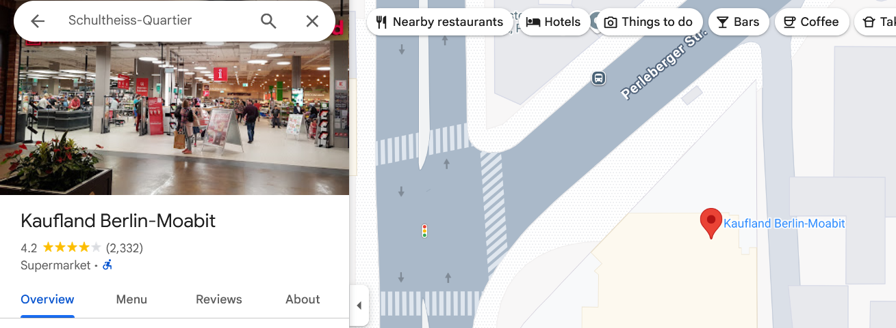

# Es ist alles in Butter

#osint

- [Es ist alles in Butter](#es-ist-alles-in-butter)
  - [The Clues](#the-clues)
  - [Reverse Image Search](#reverse-image-search)
  - [Find the supermarket at the mall](#find-the-supermarket-at-the-mall)


The challenge text is in German and we need to translate it:

```txt
My buddy and I went for a walk in a shopping mall during our visit to Germany. When we were there, we got very hungry and decided to go to a supermarket to buy fresh bread and kebabs. When we got to the store, we were pleasantly surprised to find that there was a bread slicer there! That was very practical. We wanted to go back, but we had forgotten where the shop was! Stupid Americans, aren't they? Anyway, we were lucky because my buddy happened to take a photo in the area because he liked the architecture. Can you help us find the supermarket so we can buy some fresh bread before we fly back?
```

## The Clues

- They were in Germany
- They were in a mall and went to a supermarket within the mall to get bread and kebabs
- We have a picture of the area

## Reverse Image Search



So the name of the area is Moabit Stromstraße Schultheiss Quartier, which is a mall in Berlin

## Find the supermarket at the mall

I searched for the mall on Google Maps and found its [website](https://www.schultheissquartier.de/).

I went into the `Shops` section and filtered shops by `Groceries`. I tried the name of each shop, but that didn't work. 

I looked at the flag hint and it was `Word_Word-Word`. So I figured there must be 3 three words and the last two are connected with a hyphen. 

I decided to just look on Google Maps instead and found `Kaufland Berlin-Moabit`



Kaufland is mentioned on their website, but it doesn't have show its full name.


