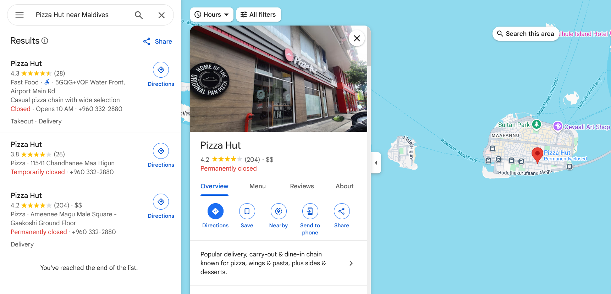
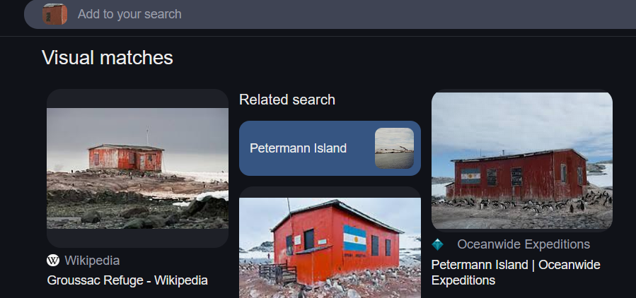

# GEOSINT (1,3,4,5,7,8,9,11,12)

#osint

- [GEOSINT (1,3,4,5,7,8,9,11,12)](#geosint-13457891112)
  - [chall1 - easy (Stadium)](#chall1---easy-stadium)
  - [chall3 - easy (Bank of Maldives)](#chall3---easy-bank-of-maldives)
  - [chall4 - easy (Bridge)](#chall4---easy-bridge)
  - [chall5 - easy (Aquarium/Submarine)](#chall5---easy-aquariumsubmarine)
  - [chall7 - medium (Seafood Watch Cafe)](#chall7---medium-seafood-watch-cafe)
  - [chall8 - medium (8th \& Cleveland Ave)](#chall8---medium-8th--cleveland-ave)
  - [chall9 - medium (Hill Top/Ropeway)](#chall9---medium-hill-topropeway)
  - [chall11 - hard (Penguins/Antarctica/Argentina Shed)](#chall11---hard-penguinsantarcticaargentina-shed)
  - [chall12 - hard (Train Station)](#chall12---hard-train-station)

The `Search by Image` extension came in really handy for this.

## chall1 - easy (Stadium)

So this is a stadium and there is a logo of a horse which reminded me of the Broncos.

Looking around there is a flipped banner spelling something like "BOISE" so I guessed it must be in Boise, Idaho

Flipped view of the banner:

Spells something like BO(I)SE

I googled "Boise broncos"  and found the a matching logo, which belongs to the "Boise State Broncos". Next I just looked for the "Boise State Broncos Stadium"

Everything from the street view matches

 
 

## chall3 - easy (Bank of Maldives)

Looking up "Bank of Maldives" on maps gave me more than a dozen locations and I couldn't find any that match so I looked up "Pizza Hut" instead, which yeilded 3 location and I was able to find one next to the Bak in Male

 
 

## chall4 - easy (Bridge)

For this I reverse image searched the buildings with the red roofs, since they seemed like a landmark.

Google didn't work but Yandex gave me the correct location.

From here we just find `Parqur Quinto Centenario`, which is in Panama and find the bridge which curves around it

 
 

## chall5 - easy (Aquarium/Submarine)

The only landmark we have here is the submarine. I initially reverse image searched the submarine and got the location, but googling `E 423 submarine` will also work

A bit of research reveals that this is USS Torsk, which is docked at a pier at the National Aquarium in Baltimore

 
 

## chall7 - medium (Seafood Watch Cafe)

This is one is designed to misguide us, and I fell for it. This is not at Monterey Bay Aquarium, California. 

So after failing, and not even getting one `You're close` prompt. I decided to follow another lead.

There is a sign called `Jellies Invasion`. I figured this must be a unique exibit so I googled this.

National Aquarium, Baltimore...

Again...

For this it is helpful to switch to satellite view or Google Earth to pinpoint the glass roof. There are 3 buildings with a glass roof so we just try each one by one. 

You could also find a map of the National Aquarium and see where Jellies Invasion is located

It's on Pier 4.

 
 

## chall8 - medium (8th & Cleveland Ave)

We just lookup `E 8th St & Cleveland Ave` on Google Maps and match each result to our street view

 
 

## chall9 - medium (Hill Top/Ropeway)

I reverse image searched the ropeway angle of the street and found a travel blog mentioning that this was Mount Hakodate, Hokkaido, Japan.

From there its easy enough, you should be able to do this on your own.
 
 

## chall11 - hard (Penguins/Antarctica/Argentina Shed)

The boats have "Oceanwide Expeditions" written on them but that lead wasn't fruitful so I just reverse image searched the shed with Argentina's flag painted on it.

Right away we can see that it is on Petermann Island, Antarctica. Oceanwide Exploration's website also pops up showing the location. 

We just search for the island on Google maps and go into street view and our location is the only street view on the island. 

 
 

## chall12 - hard (Train Station)

One last time...

I reverse image searched the turnstile angle of the train station and found a couple articles with the image. 

Morgan Boulevard Metro Station it is.