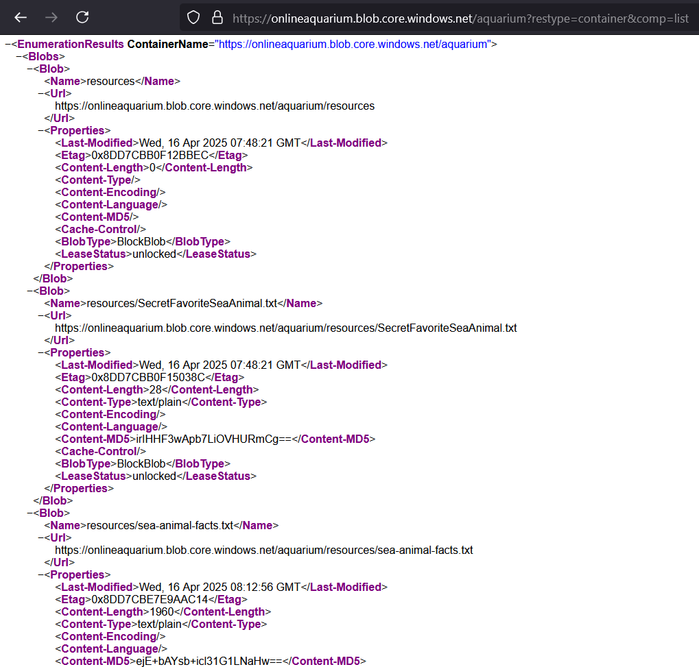

# My Aquarium

#web #fwn

- [My Aquarium](#my-aquarium)
  - [Initial Reconnaissance](#initial-reconnaissance)
  - [The exploit](#the-exploit)

## Initial Reconnaissance

After exploring each page, we can see that "Sea Animal Facts" is different. It opens a `.txt` file on a different domain `https://onlineaquarium.blob.core.windows.net/aquarium/resources/sea-animal-facts.txt`

Researching a bit about the domain reveals that it is for Azure's blob storage, which is like AWS S3.

## The exploit

I Googled "azure blob storage exploits" and found this [blog article](https://braropad.medium.com/azure-pentesting-exploiting-the-anonymous-access-to-the-blob-storage-draft-english-d80f3831a590)

The article also uses `wfuzz` to search for containers, but since we already know that the name of the container is `aquarium` we won't need it.

Using this we can make a GET request to `https://onlineaquarium.blob.core.windows.net/aquarium?restype=container&comp=list` to enumerate all the files inside the `aquarium` container

- `restype=container`: sets the resource type to container, instead of a file/blob
- `comp=list`: gives us a list of all the files/blobs stored in the `aquarium` container

`https://onlineaquarium.blob.core.windows.net/aquarium/resources/SecretFavoriteSeaAnimal.txt` has the flag