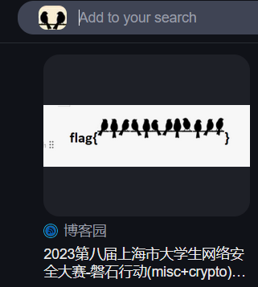
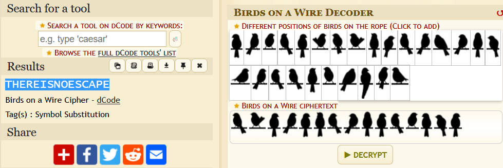

# The Birds

#crypto 

- [The Birds](#the-birds)
  - [Reverse image search](#reverse-image-search)
  - [Decode the cipher](#decode-the-cipher)

This is a crypto challenge and the birds are standing in different poses and directions so this must be some sort of cipher 

## Reverse image search

When I searched the image it led me to this [Find the Reggies Wiki](https://find-the-reggies-fanon.fandom.com/wiki/Alalal_Reggie), which mentions that the image is a "birds on the wire cipher". The image in the wiki spells "the quick brown fox", but our image has some birds which are different. 

You can also find the name of cipher using this [cnblogs.com/xiaoqi-ctf/p/17894018.html](https://www.cnblogs.com/xiaoqi-ctf/p/17894018.html), which is a CTF writeup

## Decode the cipher

Googling "birds on the wire cipher" leads us to [dcode.fr/birds-on-a-wire-cipher](https://www.dcode.fr/birds-on-a-wire-cipher)

We just pick the birds in our image to decode the message.

