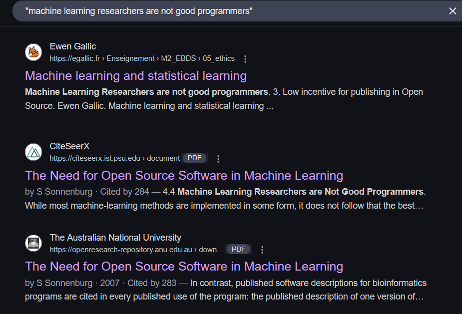
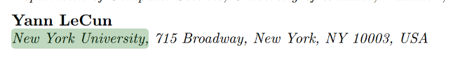
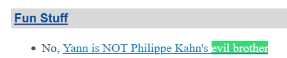
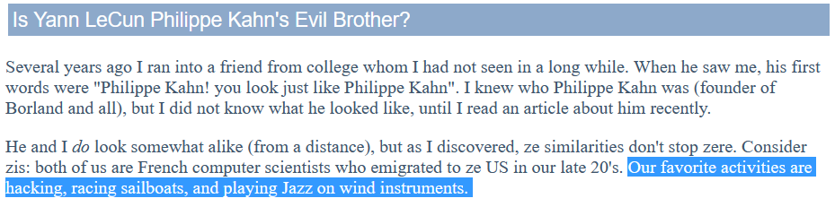

# On The Shoulders of Giants

#osint #easy

### The Clues

1. Something to do with a machine learning researcher
2. The phrase "machine learning researchers are not good programmers" is important
3. The researcher/professor is related to New York Univeristy (NYU), since Osiris Lab is at NYU
4. Evil brother???

We need to find 3 common hobbies between the professor and his evil brother

### Step 0: Search for the phrase

I googled the exact phrase "machine learning researchers are not good programmers" using quotes

Looking for the term "New York Univeristy" or "NYU" in each PDFs we find professor Yann LeCun.

### Step 1: Find more information on the professor

Searching for "Yann LeCun", we find [his website](http://yann.lecun.com/), which is also listed on his wikipedia page.

He does have a [hobbies section](http://yann.lecun.com/ex/hobbies/index.html) but only 2 are listed and no mention of an evil brother.

### Step 2: Find the evil brother

Searching for "evil brother" we find a link to him talking about Phillippe Kahn

Clicking on [Yann is NOT Phillippe Kahn's evil brother](http://yann.lecun.com/ex/ex/fun/index.html#kahn.html) and searching "evil brother" one more time we find:

Here he mentions three favorite activities (hobbies) which they have in common

1. hacking
2. racing sailboats
3. playing jazz on wind instruments

### Step 3: Assemble the flag

Follow the format and make sure to separate individual hobbies with an underscore ( _ ) and words in each hobby with a hyphen (-). All lowercase.