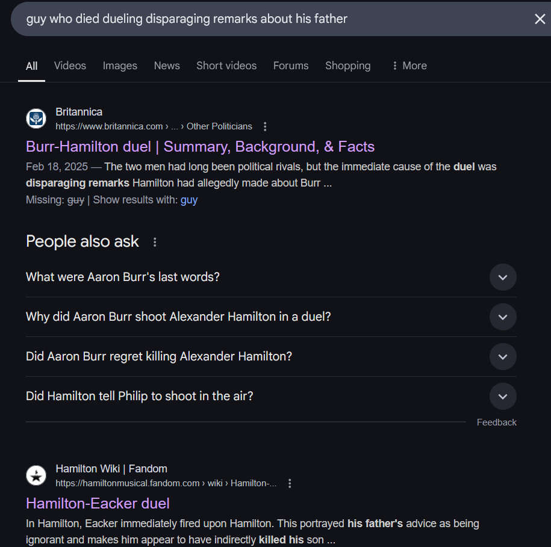
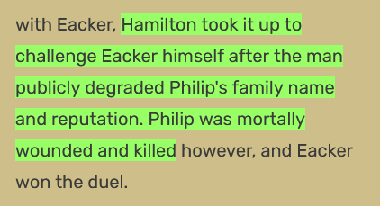
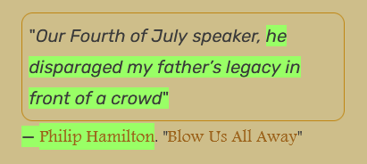
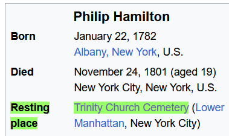
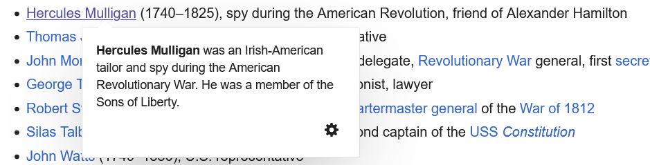
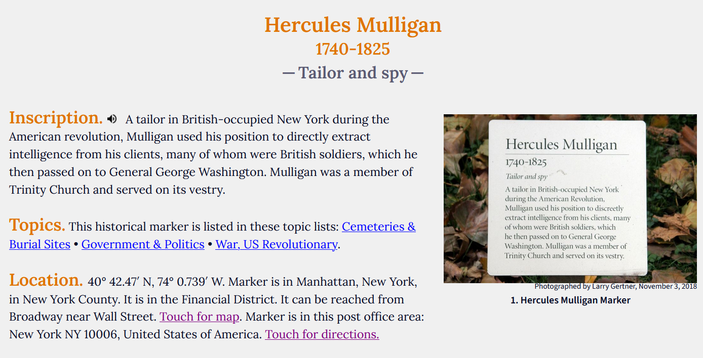
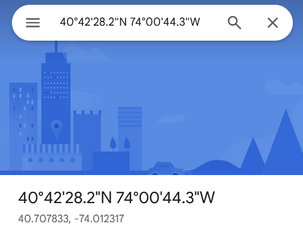

#  Tinker Tailor Solider Spy 

#osint #hard

## The Clues

1. One of the first american spies marks the spot
2. Spot is close to that guy who died dueling someone who made some disparaging remarks about his father

We need the last name of the spy and the coordinates of a location linked to clue #2. Words like "marks the spot" and "dead drop" from the challenge also allude that the location is a grave.

It can also be inferred that the spy has some connection to the location in clue #2

## Step 0: Find the guy who died dueling

I googled "guy who died dueling disparaging remarks about his father". The first result is the famous Burr-Hamilton duel, but this isn't the right one since the duel started because Hamilton had made disparging remarks about Burr. 

The second result (for me atleast) is the [Hamilton-Ecker](https://hamiltonmusical.fandom.com/wiki/Hamilton-Eacker_duel) duel. This duel took place because George Ecker had disparged Philip Hamilton's father (Alexander Hamilton), and Philip died as a result.

Therefore, the guy who died is Philip Hamilton. Even though he died in Weehawken, NJ, the challenge alludes to a grave so we need to be more precise.

## Step 1: Find Philip Hamilton's resting place

A simple search for Philip Hamilton brings up [his Wikipedidia page](https://en.wikipedia.org/wiki/Philip_Hamilton), which mentions his resting place to be Trinity Church Cemetery, NYC.

So perhaps the spy from clue #1 is also buried at Trinity Church Cemetery. 

## Step 2: Uncover the spy's identity.

On Philip Hamilton's wiki page, there is a link to Trinity Church's wiki page. On there we can find a list of [notable burials at the cemetery](https://en.wikipedia.org/wiki/Trinity_Church_Cemetery#Notable_burials)

Searching for "spy" on the page, we find, Hercules Mulligan, who was a spy during the American Revolution and a friend of Alexander Hamilton!

Now we have the first part of the flag: Mulligan!

NOTE: You can also find Mulligan by searching for "first american spies" and using the wikipedia list to check each spy's resting place.

## Step 3: Find coordinates to Mulligan's grave.

Searching "hercules mulligan grave", we get links to Trinity Church, findagrave.com, theclio.com, and finally [hmdb.org](https://www.hmdb.org/m.asp?m=222045), which has the correct coordinates! (took me a few tries)

40° 42.47′ N, 74° 0.739′ W

FUN FACT: His marker mentions that he was a tailor. Hence the challenge is titled "Tinker Tailor Soldier Spy", but it could also be a reference to the novel and movie with the same name.

## Step 4: Convert DMS to DD.

You can use an online tool or simply put the coordinates into Google Maps and it'll convert them to DD:

40.707833, -74.012317

## Step 5: Assemble the flag:

You should be able to do this based on the given flag format. Remember to remove any spaces between commas.